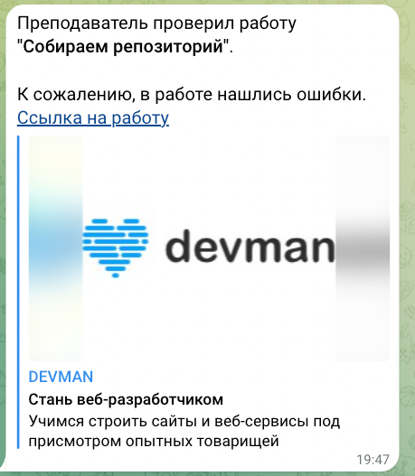

# Телеграмм бот, для проверки статуса работы.

Телеграмм бот, который уведомляет об изменении статуса работы на сайте **Devman**

## Предустановки

**Devman Token**: Его можно получить по ссылке [Информация по Api Devman](https://dvmn.org/api/docs/).
**Telegram Bot Token**: Вам также понадобится токен бота Telegram. Вы можете создать нового бота и получить токен, обратившись к [BotFather](https://t.me/BotFather) в Telegram.
**Chat ID**: Вам понадобится идентификатор чата Telegram, в котором вы хотите получать уведомления. Вы можете получить идентификатор чата, обратившись к [userinfobot](https://web.telegram.org/k/#@userinfobot).

**Python Environment**: Убедитесь, что в вашей системе установлен Python.

1. Создать `.env` файл и добавить в него
    ```text
    DEVMAN_TOKEN=your_devman_api_token
   TG_BOT_TOKEN=your_telegram_bot_token
   CHAT_ID=your_telegram_chat_id
    ```
2. Взять токен можно по ссылке [Api Devman](https://dvmn.org/api/docs/)
3. Создать файл `requirements.txt` в корневой папке проекта, и добавить:
    ```text
    # Work
    requests==2.31.0
    environs==10.3.0
    
    # Linter
    flake8==7.0.0
    ```


## Запуск

```bash
python connectToApi.py
```

## Пример ответа бота.
